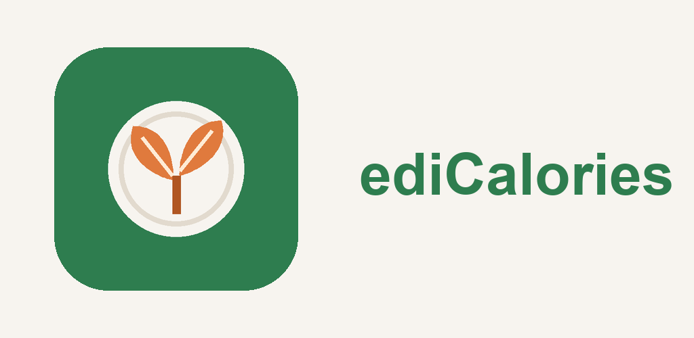

<p align="center">
  
</p>

<h1 align="center">ediCalories</h1>

<p align="center">
  A small Android journal for what you ate and what you weigh.<br>
  No account. No server. The numbers stay on the phone.
</p>

<p align="center">
  
  
  
</p>

Open the app, write down a meal, and see how much of the daily goal is left. Swipe to another day when you need it. Weigh yourself when you want a longer picture. That is the whole product.

## What you can do

**Keep a day.** The home screen is one date. It shows calories eaten, the daily goal, and whether you are under, over, or exactly on it. The default goal is 1800 kcal. You can set anything from 1 to 20000.

**Add a meal in a second.** The add button opens a side panel. Four shortcuts are always there: 50, 100, 250, and 500 kcal. Or type your own number. Each meal can also carry a time of day.

**Move through the calendar.** Swipe left or right for the next or previous day. Tap the date in the title to open a month. Days that already have meals show their total.

**Correct a mistake.** Tap a meal to change its calories or move it to another date. Deleting asks you to confirm.

**Write down weight.** The same add panel takes a weight for the selected day, from 20.0 to 400.0 kg, with one decimal place. A day keeps one weight. Saving again replaces it.

**Look back.** Progress charts cover 7 days, 30 days, 90 days, or everything you have logged. One chart is calories against the goal. The other is weight.

**Choose how the list looks.** Meals can sit in a plain list, or be grouped into breakfast, lunch, and dinner. The grouped view uses the time on each meal. You pick when each part of the day starts. The defaults are 03:00, 10:00, and 15:00, and they have to stay in that order. A meal with no time stays in its own group.

## Settings

| | |
| --- | --- |
| Language | Follow the phone, or pick English or Russian |
| Theme | Follow the phone, or pick light or dark |
| Export | An ediCalories file (`edicalories.json`) or a CSV (`edicalories.csv`) |
| Import | The ediCalories file only |
| Clear | Removes meals and weights. Goal, meal times, language, and theme stay |

The version number is at the bottom of settings.

## Your data

The journal is a local database. Settings live next to it, on the device. The app does not ask for the network and does not have an account to sign into.

Export is how you take a copy with you.

**JSON** is the backup. Import reads this file and nothing else. Meals from the file are added as new rows, so importing the same file twice creates duplicates. A weight for a day you already have is replaced. The daily goal and the meal windows come from the file. Language and theme do not.

**CSV** is for a spreadsheet. The first row is the header, then one settings row, then meals and weights. Dates are `YYYY-MM-DD`. The app does not import CSV.

Clearing logged data deletes meals and weights and leaves the rest of the settings alone. It cannot be undone.

## Build

You need Android Studio with JDK 25. The Gradle wrapper downloads Gradle 9.6 itself.

```bash
git clone https://github.com/tunerok/ediCalories.git
cd ediCalories
```

Open the folder in Android Studio and run the `app` configuration, or from a terminal:

```bash
./gradlew :app:assembleDebug
```

The debug APK is written to `app/build/outputs/apk/debug/`.

Unit tests:

```bash
./gradlew :app:testDebugUnitTest
```

### Release

A release build is smaller, shrunk with R8, and signed with your own key. Copy the example file and fill in the passwords. Do not commit `keystore.properties` or the `.jks` file. Both are gitignored.

```bash
cp keystore.properties.example keystore.properties
```

`keystore.properties.example` expects this layout:

```
storeFile=keystore/edicalories-release.jks
storePassword=
keyAlias=edicalories
keyPassword=
```

Then:

```bash
./gradlew :app:assembleRelease
```

The signed APK is `app/build/outputs/apk/release/app-release.apk`. Keep the keystore. Without the same key, an update will not install over the previous one.

Current release: version name **1.1**, version code **2**. Package id: `com.example.edicalories`.

## Stack

| | |
| --- | --- |
| UI | Jetpack Compose, Material 3 |
| Language | Kotlin 2.2 |
| Min / target SDK | 26 / 37 |
| Journal | Room |
| Settings | DataStore |
| Android Gradle Plugin | 9.4.1 |

## Layout

```
app/src/main/java/com/example/edicalories
├── data        database, repositories
├── domain      goals, meals, weight, import and export
└── ui          today, progress, settings, theme
store           icon and feature graphic, not packaged in the APK
```

## Store artwork

`store/icon-512.png` is the 512×512 icon. `store/feature-graphic.png` is the 1024×500 banner. They match the launcher icon and are not part of the APK.
